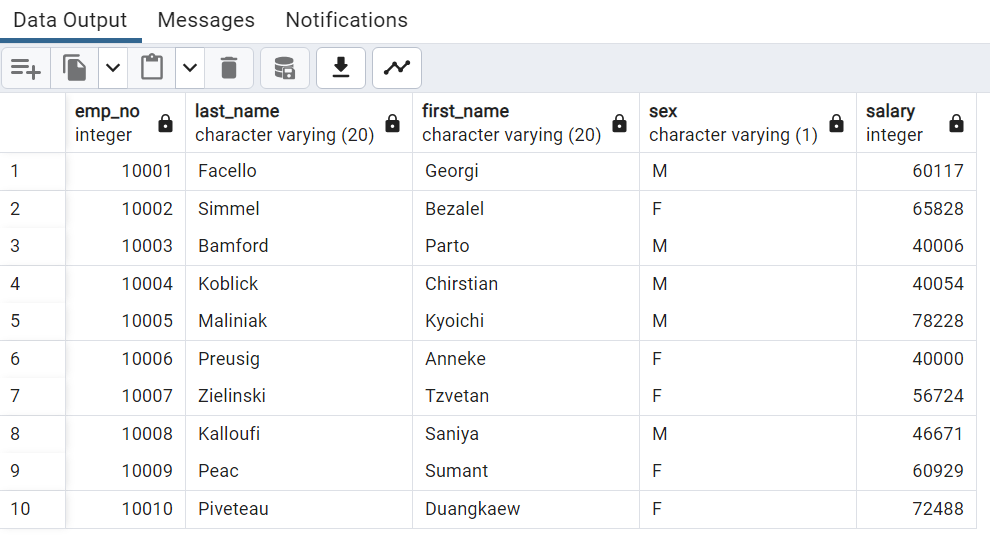
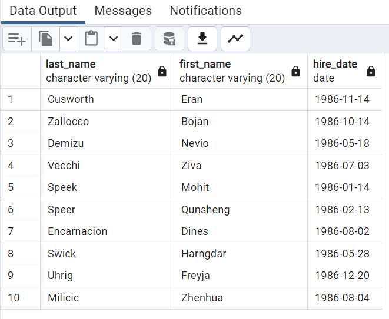
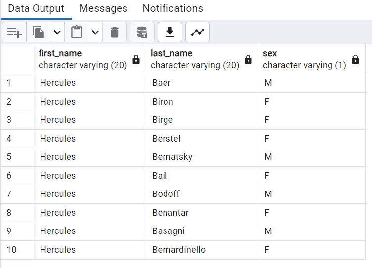
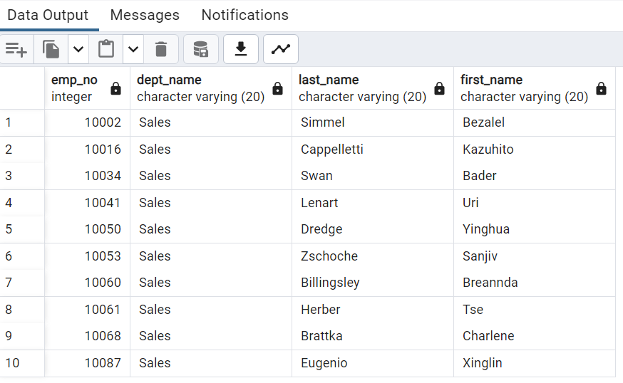

# Employees_Database_Analysis
 
# EmployeeSQL

Hi, let's work on an awesome database.

### 1 Introduction 

- An employee databse is here to research employees of the corporation from the 1980s and 1990s. All that remain of the database of employees from that period are six CSV files.

- Design the tables to hold data in the CSVs, import the CSVs into a SQL database, and answer questions about the data.

- In other words, perform:

 Data Engineering using SQL and Postgres
 Data Analysis using Python

### 2 Prerequisites

- Python 3.6 or higher
- PostgreSQL database
- pgAdmin

### 3 Data Modeling

- Inspect the CSV files, and then sketch an Entity Relationship Diagram of the tables. 

- To create the sketch, we use a QuickDBD as one of best tool for design ERD.

- Here is how the database model prepared.

### 4 Data Engineering

#### 4.1 Create the Database and Table Schema

Create the Employees_DB database in pgAdmin using SQL.

- Create a table schema for each of the six CSV files. 

- Remember to specify the data types, primary keys, foreign keys, and other constraints.

- Create the tables in the correct order to handle the foreign keys.

#### 4.2 Import Data Files 

- Inspecting the data files, I experience that sometimes there is datestyle format difference for different databases.

- For these files I need to set the datestyle in the "Employees_DB" database which corresponds to the same in CSV files.

- After setting the above datestyle format for the particular database, I could able to import the data.

- Then, here we can see how successfully the process for all six files completed.

#### 4.3 View Single Table Data

To look at a glance, one of the main table query is here (with first five rows):

### 5 Data Analysis

Our observation of data analysis depicts the information as required for each query (with first 10 rows).

#### 5.1 Salary by Employee

List the employee number, last name, first name, sex, and salary of each employee

#### 5.2 Employees Hired in 1986

List the first name, last name, and hire date for the employees who were hired in 1986

#### 5.3 Manager of Each Department

List the manager of each department along with their department number, department name, employee number, last name, and first name 

#### 5.4 Department of Each Employee

List the department number for each employee along with that employee’s employee number, last name, first name, and department name.

#### 5.5 Employees whose first name is "Hercules" and last names begin with "B"

List first name, last name, and sex of each employee whose first name is Hercules and whose last name begins with the letter B.

#### 5.6 Employees in the Sales Department

List each employee in the Sales department, including their employee number, last name, and first name.

#### 5.7 Employees in the Sales and Development Departments

List each employee in the Sales and Development departments, including their employee number, last name, first name, and department name.

#### 5.8 Frequency of Employee Last Names

List the frequency counts, in descending order, of all the employee last names (that is, how many employees share each last name).

